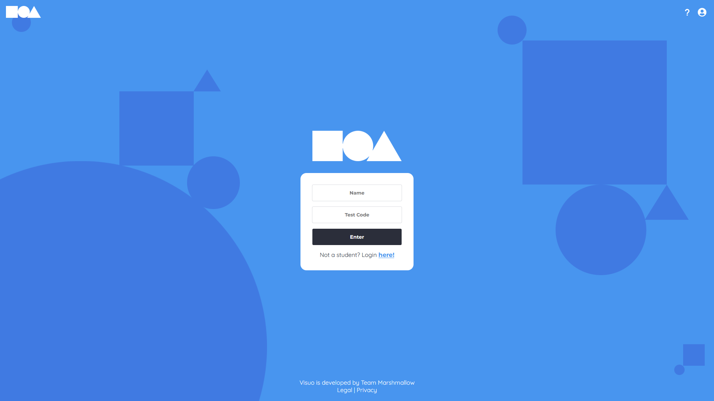
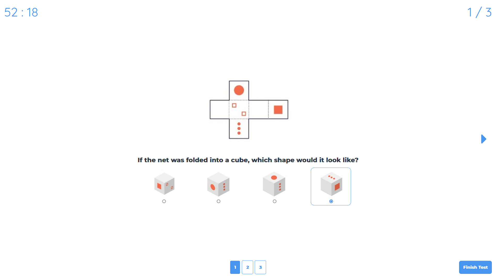
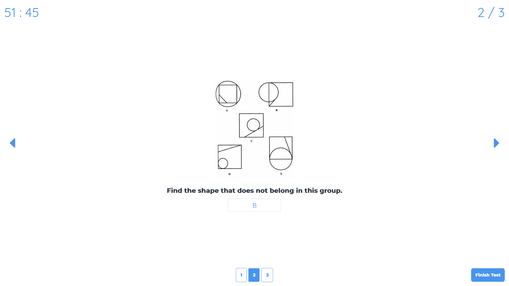
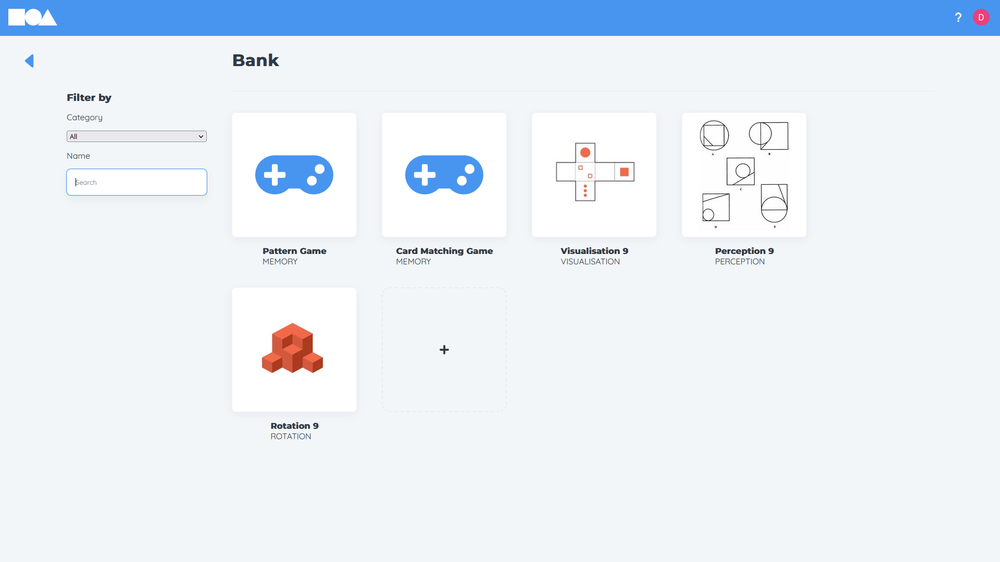
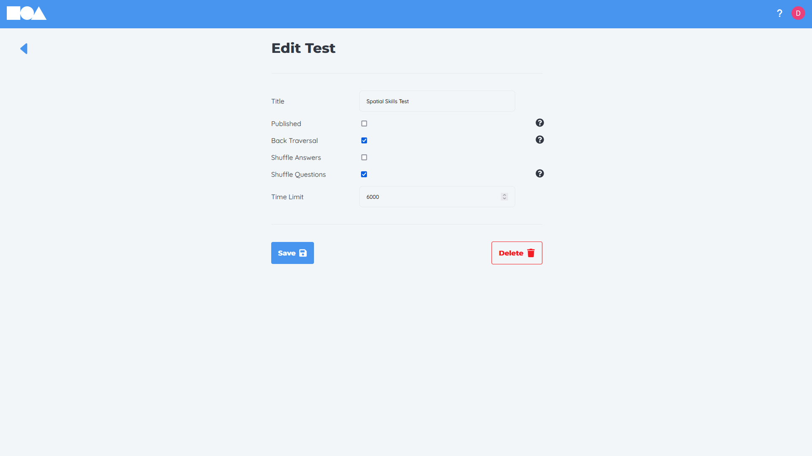
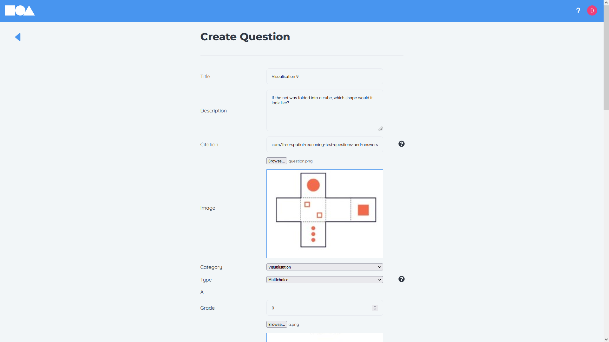

# Visuo

## Description

Visuospatial comprehension is a significant predictor of achievement in STEM fields. Visuo is a web application for educators to test STEM students visuospatial comprehension. This will assist educators in identifying weaknesses and helping students aspiring for success in STEM.

The web application functionalities include,

- Creating timed tests
- Creating multichoice and text questions
- Question editor
- Two inbuilt dynamic memory questions (pattern tapping & card matching)
- Student access to tests through a unique code
- Automated marking of tests
- Spreadsheet export of student grades

Link to report: (pending)

## Management

We used the following tools during development of the app,

- [Projects](https://github.com/orgs/uoa-compsci399-s2-2022/projects/4/views/1)
- [Issues](https://github.com/uoa-compsci399-s2-2022/visuo/issues?q=is%3Aopen+is%3Aissue)
- [Minutes](https://drive.google.com/drive/folders/1QIsV_Z1b1XvqFnn_NmShdaVvuUFazeZc?usp=sharing)

## Tools and Technologies

- Git `v2.36.1` (Version control)
- Node `v16.13.0` (JavaScript runtime)
- React `v18.2.0` (Frontend framework)
- Express `v4.18.1` (Backend framework)
- MongoDB `v6.0.1` (Document database)
- AWS S3 (Content Delivery Network)
- Google OAuth 2.0 (Authentication & Authorisation)
- Certbot & LetEncrypt (SSL certificate)
- AWS EC2 Ubuntu 22.04 LTS (Deployment)
- Nginx `v1.18.0` (Web-server)
- pm2 `v5.2.2` (Node process manager)

## Getting started

First you must have the following installed.

- [Node](https://nodejs.org/en/download/)
- [Git](https://git-scm.com/downloads)

After installing the above prerequisites. Clone the repository locally.

```
git clone https://github.com/uoa-compsci399-s2-2022/visuo.git
```

Then install the necessary dependencies.

```
cd visuo
npm install
npm run init
```

To run the project.

```
npm run dev
```

To run the backend environment you must have the associated `.env` file which contains sensitive information for AWS, Google, JWT and MongoDB. Contact Anna Trofimova (anna.trofimova@auckland.ac.nz) for this file.

## Screenshots



> Home Page



> Example test multi-answer question



> Example test text answer question



> Question bank



> Test editor



> Question editor

## Deployment

https://hydrohomiebeerbro.com (placeholder)

## Future Plans

- Dark Mode/Alternate themes
- Global question bank, enable users to share questions
- Mobile support
- Student answer viewer, enable admins to view the answers students gave

## Acknowledgements

We would like to thank Burkhard Wuensche for his feedback during the development process.

Tutorials used:

- Obtaining SSL certificate - https://www.linode.com/docs/guides/enabling-https-using-certbot-with-nginx-on-ubuntu/
- Deployment - https://betterprogramming.pub/deploy-mern-stack-app-on-aws-ec2-with-letsencrypt-ssl-8f463c01502a

## Team

<table>
  <tr>
    <td align="center">
      <a href="https://github.com/DamonGreenhalgh">
        <br />
        <b>Damon</b>
      </a>
    </td>
    <td align="center">
      <a href="https://github.com/wukelang">
        <br />
        <b>Luke</b>
      </a>
    </td>
    <td align="center">
      <a href="https://github.com/JackHH7297">
        <br />
        <b>Jack</b>
      </a>
    </td>
    <td align="center">
      <a href="https://github.com/ryanla-bme">
        <br />
        <b>Ryan</b>
      </a>
    </td>
    <td align="center">
      <a href="https://github.com/Vladd242">
        <br />
        <b>Ethan</b>
      </a>
    </td>
  </tr>
</table>
